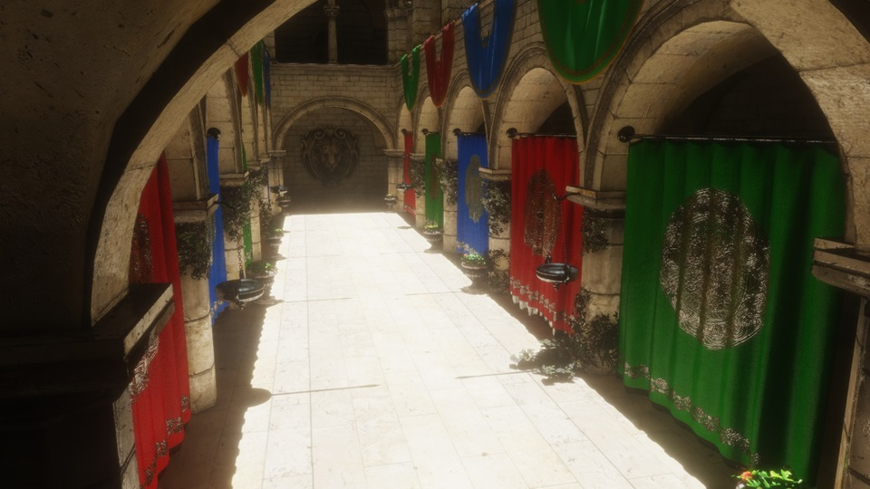
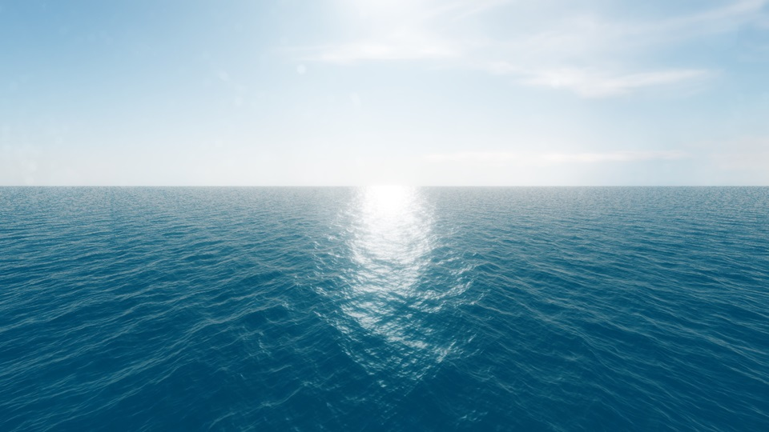
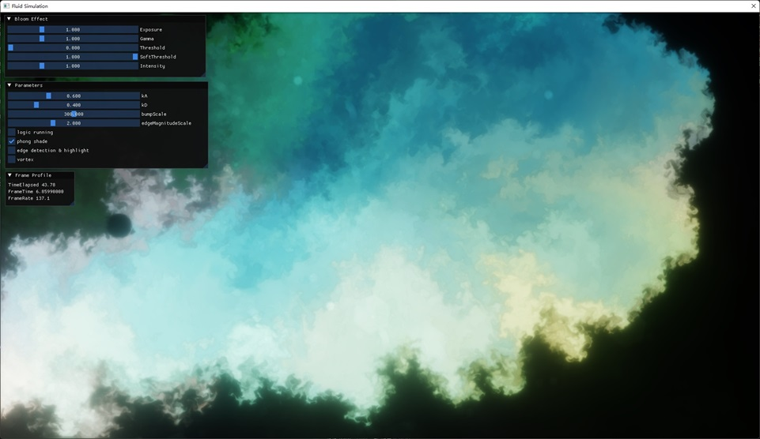
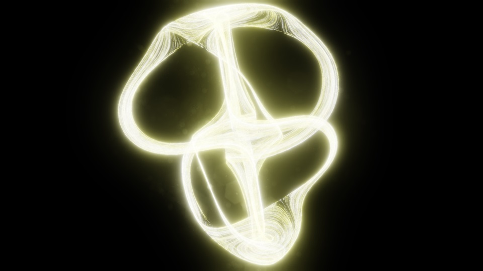
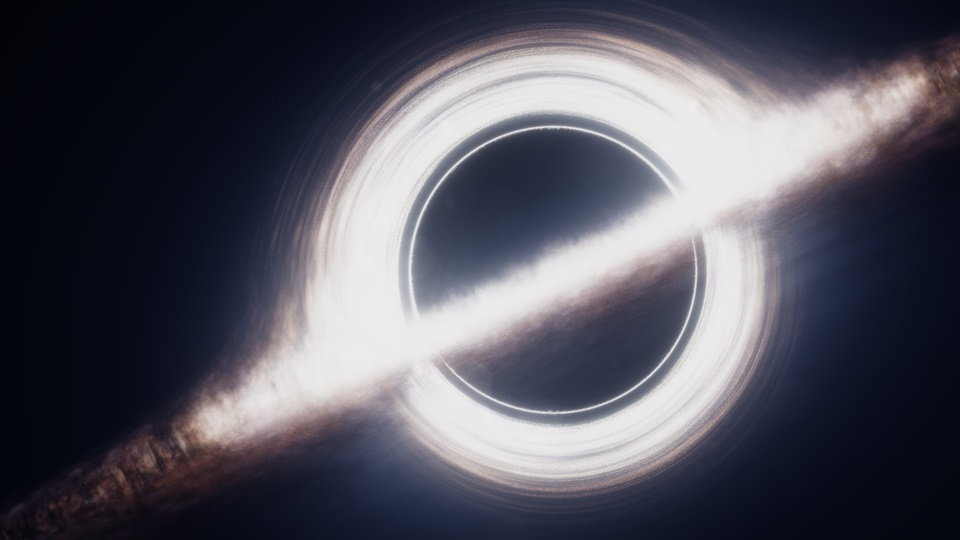
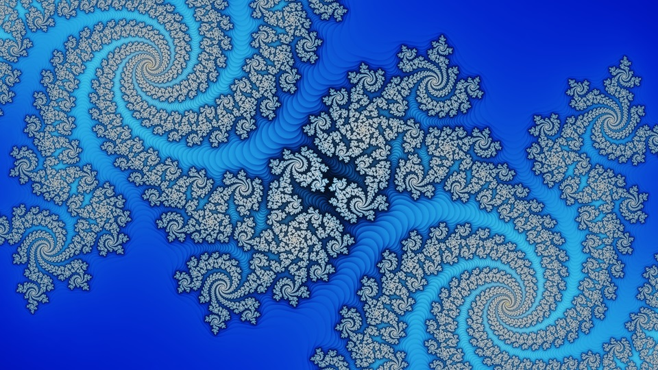
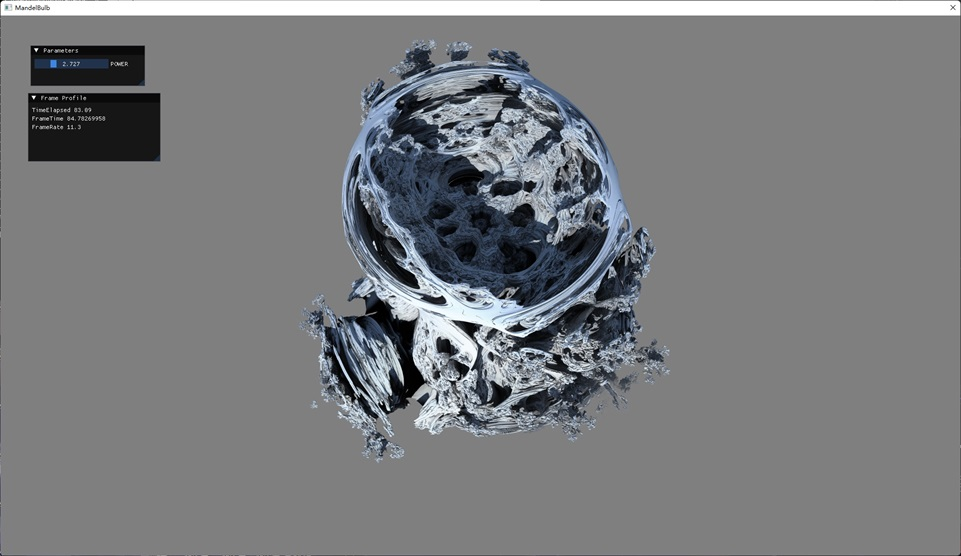
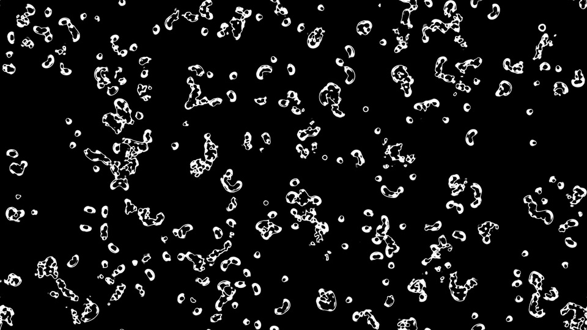
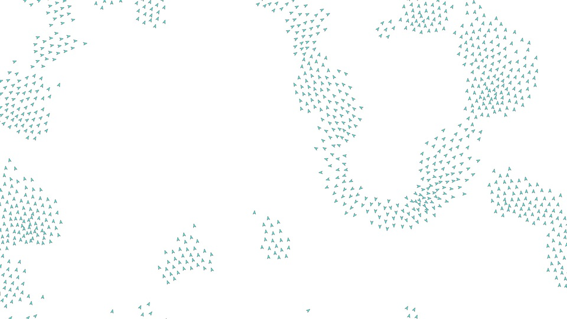

# Gear Engine v0.1

这是我学习 Direct3D 12 以来一直在构思并编写的一个图形引擎。

引擎的介绍部分有些地方是AI生成的😂，我提供了一些见解让AI撰写，最近实在是没太多时间，所以只能出此下策。但是我能保证引擎除了第三方库之外的99%的功能都是我自己写的，这几百个Git提交记录能为我证明。

当初接触 D3D11 时总觉得它不够灵活——资源绑定槽位固定、驱动层黑箱太多，很多想做的事情束手束脚。D3D12 完全不同：每一个 draw call、每一个 dispatch call 都能通过 Root Signature 拿到最新鲜的数据，资源管理、管线状态、命令录制全部暴露在开发者手中。但它的 API 又太底层了——一个三角形就要写几百行代码。于是我开始构思 Gear：**尽可能实现 D3D11 的便捷性，同时尽可能利用 D3D12 的灵活性**。在无数个空闲的碎片时间里，这个引擎就应运而生了。

今天算是这个引擎的第一个里程碑——0.1 版本。还远谈不上完善，但已经能支撑十几类不同的图形与计算实验了。

## 参考与致谢

下面这些资料对我帮助极大，不仅是理解 D3D12 本身，更是直接地影响了整个引擎架构的设计思路：

- **微软官方 D3D12 文档**
  - [Direct3D 12 programming guide](https://learn.microsoft.com/en-us/windows/win32/direct3d12/directx-12-programming-guide)
  
- **微软 D3D12 教学视频**
  - [DirectX 12: Heaps and Resources in DirectX 12](https://youtu.be/fnYVSP9QgNM?si=CrsEvkPb9AXO3aQJ)
  - [DirectX 12: Resources Barriers and You](https://youtu.be/Db2TaG49SRg?si=431Q0uY2z3Bv3sBa)
  - [Resource Binding in DirectX 12 (pt.1)](https://youtu.be/Uwhhdktaofg?si=1NP2gKoBFS1kNdrA)
  - [Resource Binding in DirectX 12 (pt.2)](https://youtu.be/Wbnw87tYqVg?si=LEFuvwMcQ0DAawiQ)
  - [Resource Binding in DirectX 12 (pt.3)](https://youtu.be/9YdIMYJ96Aw?si=LUb0IKb-0IcnhExs)
  - [DirectX 12: DirectX 11 to DirectX 12 porting guide](https://youtu.be/BV64mdOCgZo?si=kFWL8WGC-2Y8hl0x)
  - [DirectX 12: Resource Barriers and State Tracking](https://youtu.be/nmB2XMasz2o?si=XxneEtW2KhcmcdQW)

- **NVIDIA 引擎设计最佳实践**
  - [D3D12 Dos and Don'ts](https://developer.nvidia.com/dx12-dos-and-donts)

---

我也在写个人博客：[TiredInkRaven](https://www.cnblogs.com/TiredInkRaven)。还在学习，只能写点自己觉得有用的东西，如果恰好对你有帮助就太好了。

## 引擎概览

### 设计思路

Gear 的搭建围绕几个核心原则：

- **Pimpl 惯用法**：核心模块广泛采用 Pimpl 惯用法，对外暴露简洁接口，Internal 实现层处理 D3D12 细节与资源生命周期。
- **命令列表聚合**：每个 RenderTask 独立录制命令列表，引擎在帧末尾统一提交给命令队列执行。这是来自 NVIDIA 那一系列 D3D12 Dos and Don'ts 的指导——避免频繁提交分散的小命令列表。
- **资源状态追踪**：GraphicsContext 内部维护资源状态机，自动插入资源转换屏障，并自动完成资源绑定，减少手动管理的出错可能。
- **全局常量缓冲**：每帧自动填充 delta time、time elapsed、屏幕尺寸、相机矩阵、随机种子等常用数据到预留的 Dynamic Constant Buffer 中，所有 Shader 通过包含 `Common.hlsli` ，使用 `perframeResource.****` 访问相关数据，省去逐帧手动传参的麻烦。
- **后处理管线**：ToneMap、GammaCorrect、BackBufferBlit 作为内置后处理基链。项目可按需灵活插入 Bloom、FXAA、SSR 等 Effect，组合成完整的后处理流程。

### 设计灵感

这个引擎里不少类的思想来自我开始学图形学以来的各种实践以及接触到的一些东西。它们来自不同的时代和不同的 API 生态，但在 Gear 里融合到了一起。

#### Effect 系统 

它的灵感来自 **Effects 11**（Direct3D 11 时代的 Effect Framework）。那个框架用 .fx 文件把 Shader、RenderState、Pass 打包成一个自包含的 Effect 对象，Gear 里的 `EffectBase` 和各个 `*Effect` 子类延续了同样的思路——一个后处理效果就是一个自包含单元，自己管理 PSO、Shader、资源，对外只暴露 `process()`。

#### RenderTask 

这一概念源自 **dispatch call** 思想的泛化。GPU 端的 dispatch call 是把一个计算任务派发到 Compute Shader 去执行，RenderTask 则是把一整个渲染任务派发到一个独立录制的命令列表中。每个 Task 只关心自己这一段录制逻辑，引擎在帧末尾统一提交，和 GPU 上调度 compute 格子有异曲同工的地方。

#### PipelineResourceDesc.h 

这个头文件中的所有结构体的设计灵感来自 D3D12 原生 API 中的 `D3D12_SHADER_RESOURCE_VIEW_DESC`、`D3D12_RENDER_TARGET_VIEW_DESC` 和 `D3D12_UNORDERED_ACCESS_VIEW_DESC`。这些结构体使用 union 区分不同的资源子类型（如 Buffer 和 Texture），Gear 里的 `ShaderResourceDesc`、`RenderTargetDesc`、`DepthStencilDesc` 等遵循了同样的模式——用 enum 标记资源类型、用 union 承载类型特定的描述数据。在进行资源绑定时，用户不需要手动调用 D3D12 API，只需调用高级资源（如 `TextureRenderView`）暴露的 `get` 方法获取对应的描述结构体，传入 `GraphicsContext`中，引擎内部便会利用传递过来的结构体完成期望的资源绑定，并且在draw call和dispatch call前自动插入资源屏障。

#### Bindless设计

它的设计来自微软发布的[Shader Model 6.6的文档](https://microsoft.github.io/DirectX-Specs/d3d/HLSL_ShaderModel6_6.html)和[WickedEngine](https://wickedengine.net/2021/04/06/bindless-descriptors/)相关的实践。这么做会让引擎的资源绑定框架较为容易编写，此外也解放了着色器，大幅提高了它的灵活度，可以像下方的样例代码那样轻松地访问或修改资源。

```hlsl
cbuffer TextureIndices : register(b2)
{
    uint colorReadTexIndex;
    uint colorWriteTexIndex;
}

static Texture2D<float4> colorReadTex = ResourceDescriptorHeap[colorReadTexIndex];

static RWTexture2D<float4> colorWriteTex = ResourceDescriptorHeap[colorWriteTexIndex];
```

#### 启动流程

  ```cpp
  Gear::initialize();
  if (!Gear::iniEngine(param, argc, argv))
  {
      Gear::iniGame(new MyGame());
  }
  Gear::release();
  ```

  上述写法其实来自于 **libgdx**（一个 Java 游戏框架）。libgdx 里也是创建一个 `ApplicationListener`（相当于 `Game`类），然后交给框架的 `initialize` / `render` / `dispose` 生命周期去驱动。这种框架控制主循环、用户只关心游戏逻辑的模式在 Gear 里被完整地搬了过来。之所以会想到它，是因为我很久以前——大概大一的时候——用它做过小游戏（比如那个Flappy Bird什么的），那种简洁的启动流程一直留在我心中。

---

自**libgdx**后我还有 OpenGL 和 D3D11 的代码实践积累，再加上编写这个引擎的过程中我也在不停地学图形学知识和 C++，各种重构和新想法不断往里塞，这个引擎才慢慢变成今天这个样子。

### 当前限制与设计说明

- **资源绑定与 Shader Model 6.6**：目前的资源绑定框架基于 Shader Model 6.6 设计。如果不使用 SM 6.6，那么资源绑定框架对我来说会较为难以设计。好在支持 Shader Model 6.6 的显卡覆盖范围还是比较广的，最低端的卡大约可以到 GTX 1650 Ti、GTX 1660 Ti 这个级别。
- **Bindless 设计倾向**：编写引擎之初我查阅了 NVIDIA 的 D3D12 Dos and Don'ts，里面明确提到了"Prefer a 'bindless' design."。Gear 当前的资源绑定路线正是朝着 bindless 方向走的，这也是选择 SM 6.6 作为最低 Shader Model 门槛的原因之一。
- **多线程指令录制**：引擎在设计上是原生支持多线程录制命令列表的，`Game` 基类里有方法可以调度子渲染线程。不过目前我还没有进行充分的测试，所有示例项目都只使用**一个**子渲染线程来记录指令。后续需要更多验证后再在生产环境中启用多线程录制。
- **离线渲染的硬件限制**：由于我手头只有一张 NVIDIA 的显卡，当前视频编码模块（NVENC）只封装了 NVIDIA 的编码 API，无法为 AMD（AMF）或 Intel（QSV）等其他厂商的显卡编写视频编码封装。后续如果有能力接触到其他厂商的硬件，可能会进行相应的实现。

### 运行模式

| 模式 | 说明 |
|---|---|
| REALTIMERENDER | 标准窗口应用，支持 ImGui 调试面板 |
| VIDEORENDER | 无头渲染，通过 NVENC 编码输出 MP4 |
| WALLPAPER | 渲染到桌面壁纸窗口层 |

### 核心子系统

| 模块 | 说明 |
|---|---|
| GraphicsDevice | D3D12 设备初始化、Feature Support 检查、适配器选择 |
| GraphicsContext | 命令列表封装，状态追踪与资源绑定自动化，提供 draw/dispatch/set*SConstants 等高层接口 |
| ResourceManager | GPU 资源工厂，支持创建各类低级资源和高级资源 |
| PipelineStateBuilder | 流式 PSO 构建器，通过 Builder 模式链式配置 |
| PipelineStateHelper | 常用 PSO 状态预设（Blend/Rasterizer/DepthStencil） |
| RenderTask | 渲染任务基类，用户继承后重写 `recordCommand()` |
| RenderThread | 后台线程异步创建 RenderTask，`createRenderTaskAsync` 模板函数 |
| GlobalShader | 内置公用 Shader（FullScreenVS、FullScreenPS、TextureCubeVS） |
| GlobalEffect | 内置后处理：ToneMap、GammaCorrect、HDRClamp、BackBufferBlit、LatLongMapToCubeMap |
| Effect 系统 | 可复用的屏幕空间效果：Bloom、FXAA、SSR、HBAO+ |
| MainCamera | 全局相机状态，View/Proj 矩阵自动写入全局常量缓冲 |
| FPSCamera / OrbitCamera | WASD 自由移动 / 轨道旋转相机 |
| Input | Keyboard（按键事件注册/注销）、Mouse（位置、按键、移动、滚轮） |
| SwapTexture | 乒乓纹理辅助类，流体/粒子等需要前后缓冲区交替的计算类项目必备 |
| VideoEncoder | NVENC 硬件编码支持 |
| DXCCompiler | 运行时 HLSL 编译 |
| Logger | 彩色日志系统 |

## 示例项目

### SampleProject
最小化示例，演示引擎基本骨架：创建窗口 → 初始化引擎 → 新建 Game → 录制渲染命令。使用全屏三角形配合 Pixel Shader 生成基于哈希的随机色彩图案，适合作为新项目的模板。

### PBRRendering
基于物理的渲染（PBR）+ 基于图像的光照（IBL）。从 HDR 等距柱状图生成环境立方体贴图，分别计算漫反射辐照度图和镜面反射预过滤图，使用预计算的 BRDF LUT。Assimp 加载模型。支持 Orbit 相机旋转观察，ImGui 面板控制金属度/粗糙度/IBL 开关。

### CrytekSponza
延迟渲染管线。Geometry Pass 输出世界坐标+金属度、法线+粗糙度、BaseColor 三张 G-Buffer；Lighting Pass 通过全屏三角形完成 PBR 光照。集成 4096x4096 Shadow Map、HBAO+ 环境光遮蔽、屏幕空间反射（SSR，含 Hi-Z 加速）、FXAA 抗锯齿和 Bloom 后处理。使用 17x9x12 辐照度探针网格+八面体编码存储间接光照信息。FPSCamera 自由漫游，天空盒为 HDR 立方体贴图。



### FFTOcean
基于快速傅里叶变换的海洋模拟。三个级联波（250m/17m/5m），每级独立生成 Phillips 频谱并通过 Butterfly IFFT 计算位移、法线导数和雅可比矩阵。使用屏幕空间投影网格+曲面细分（Hull/Domain Shader）逐帧更新海浪几何，Domain Shader 从级联合并后的位移图采样顶点偏移。Pixel Shader 完成天空反射+阳光镜面高光+泡沫渲染+级联 LOD。FPSCamera 自由漫游，Bloom 后处理。



### FluidSimulation
Stam 流体求解器的 Compute Shader 实现。完整管线：速度/颜色注入 → 涡流计算与约束 → 散度计算 → 雅可比压力求解（35 次迭代）→ 梯度减除 → 速度/颜色平流 → 边界条件处理。可选 Phong 着色、Sobel 边缘检测高亮、Bloom 后处理。ImGui 面板可调所有参数。相关文章：[基于欧拉法的2D流体模拟](https://www.cnblogs.com/TiredInkRaven/p/18459640)



### SimpleParticleEffect
Compute Shader 驱动的粒子系统（50,000 粒子）。CS 每帧更新粒子位置（带耗散因子），Point List 拓扑配合 Geometry Shader 将每个点扩展为Line Strip，Pixel Shader 着色。使用加法混合，含 Bloom 和 FXAA 后处理。粒子初始分布于球壳上，DXC 运行时编译 Shader。



### BlackHole
全屏 Pixel Shader 实现的黑洞引力透镜效果，通过叠加多层噪声和星盘纹理，以指数函数模拟光线在黑洞极强引力场中的弯曲路径，将背景扭曲为环形结构。ImGui 面板可调纹理周期、噪声层级参数等。含 Bloom 后处理。着色器代码来自[sonicether](https://www.shadertoy.com/view/lstSRS)，我改装成了循环模式，可以渲染成动画作为动态壁纸。



### MandelBrotSet
Compute Shader 实时渲染 Mandelbrot 集分形。鼠标拖拽平移、滚轮缩放，使用帧累积插值实现平滑过渡。ImGui 面板可调缩放和插值参数，含 Bloom 后处理。



此外还有一个相关的 [OpenCL 离线渲染项目](https://github.com/PuddingCoke/OpenCLTest)，使用 OpenCL 在 GPU 上离线计算 Mandelbrot 集，支持 64x64 样本全场景抗锯齿，可输出 7680x4800 高分辨率图像。

### MandelBulb
全屏 Pixel Shader 光线步进渲染 3D Mandelbulb 分形。双 pass 设计：Accumulate Shader 每次迭代向累积纹理混合新采样（使用 alpha blend），Display Shader 读取累积结果输出到屏幕。鼠标拖拽旋转视角、滚轮缩放，帧索引跟踪确保视角变化时重新累积。ImGui 可调迭代指数。



### SmoothLife
Continuous-domain 细胞自动机（SmoothLife）。Compute Shader 实现：白噪声初始化 → 演化（EvolveCS，基于内外半径和内外阈值的连续域规则）→ 可视化（VisualizeCS，将标量场映射为 RGBA）。SwapTexture 乒乓缓冲，定时器控制演化步长。ImGui 面板可调全部 7 个参数，K 键重新初始化。




### Steering Behavior
基于 Reynolds 转向行为的群体模拟（1000 个体）。Compute Shader 每帧计算分离（Separation）、对齐（Alignment）、凝聚（Cohesion）三重基本行为力，鼠标移动触发逃离（Flee）行为——鼠标周围一定半径内的个体会远离光标。StepCS 负责群体逻辑，SwapBuffer 双缓冲位置与速度数据；Geometry Shader 将每个点扩展为带纹理的箭头三角形，Pixel Shader 上色并与箭头贴图混合。使用 alpha 混合渲染个体。



### EncodeTest
简单的视频编码测试程序，用于验证引擎的 NVENC 硬件编码功能。关于离线渲染，我的引擎代码中提供了相关的实现细节，此外我还写了一篇文章：[使用NVENC API编码D3D12纹理](https://www.cnblogs.com/TiredInkRaven/p/18656474)。这里稍微多提一下，离线渲染这个功能是我大二的时候心血来潮在我写的OpenGL老项目中实现的，当时还不能直接搞得利用CUDA，相关的代码在[这个仓库](https://github.com/PuddingCoke/Cuda-OpenGL-Encode)。后来学D3D11的时候在D3D11老项目中也实现了离线渲染功能，D3D11老项目代码写得太烂了，就不提供相关的实现了。当时真的就是觉得实现这个功能很有意思，觉得可以做点小动画什么的。所以就去网上学了一点和视频编码相关的知识，然后阅读英伟达发布的文档和源代码实现了相关功能。怎么说呢，用实时渲染的API来搞离线渲染可能稍微有点背道而驰，但是我就是觉得有意思，所以实现了这个功能。

---

## 如何使用

### 创建新项目
直接以 SampleProject 为模板创建项目即可。项目结构很简单：

1. `main.cpp` —— 入口，初始化引擎和 Game
2. `MyGame.h` —— 继承 `Gear::Game`，处理 update/render 和相机输入
3. `MyRenderTask.h` —— 继承 `RenderTask`，在 `recordCommand()` 中录制所有渲染/计算命令

### 查看日志
日志输出为 UTF-8 编码的"log.txt"文件，需要在支持 UTF-8 的终端中查看。

### 外部依赖

| 依赖 | 用途 |
|---|---|
| DirectXTex | DDS/WIC 纹理加载 |
| DXC Compiler | 运行时 HLSL 编译 |
| HBAO+ (NVIDIA) | 屏幕空间环境光遮蔽 |
| NVENC (NVIDIA) | 视频硬件编码 |
| OpenEXR | HDR 图像加载 |
| Assimp | 3D 模型导入 |
| ImGui | 调试 UI |
| stb_image_write | 截图输出 |

预编译的 .lib 和 .dll 以及其它的依赖资源已放置在 `Libs/` 和 `Dependencies/` 目录中。SampleProject项目已经被配置好了，这个项目的链接器的输入的附加依赖项中已经添加了所有需要链接的静态库。此外，编译后会自动拷贝 `Dependencies/` 目录下的所有文件到EXE输出目录。

---

## 有感而发

最近让AI帮忙回顾了一下这个引擎编写的历史，才发现这个引擎已经编写了大概两年了，从大二下还是大三上开始的。真的有点感慨万千，当时真的就是觉得D3D11太呆板了，所以才学的D3D12。当时看完[DirectX 12: DirectX 11 to DirectX 12 porting guide](https://youtu.be/BV64mdOCgZo?si=kFWL8WGC-2Y8hl0x)这个视频后真的感觉TMD难于登天，视频是看懂了个大概，但是资源绑定框架和资源状态转变框架的实现构思了好久，在查阅了一些资料后才实现一个雏形，引擎有好长一段时间处于“still in draft”阶段，当时真的感觉好艰难，还有一点是我那个时候还不太会C++，所以才会那么步履维艰。

好在我学过OpenGL和D3D11，并且对图形学有一定的了解。这期间也是坚持下来了，一直在完善引擎。想着哪里的功能可以写得完善一些，哪里可能会有潜在的BUG，一直在缝缝补补。比如那个资源状态转变的逻辑，写完之后利用空闲时间，我是真的检查了好多遍，真的TMD怕出错。当然了我也在学习图形学相关的知识，还有一直在精进对C++的了解，写各种自己感觉有趣的示例项目（就比如这个视频编码小项目）。引擎现在这个样子和前些年的差别真的是一个天一个地，以前还是各种单例和友元泛滥使用，看着自己以前写的代码，真的想是扇自己一个巴掌，现在看着倒是好多了，但是还是有着很多可以改进的地方。

现在的框架虽然比较完善了，但是完成一个小项目还是要写蛮多的代码。我是个懒鬼，写样板代码对我来说是真的有点难受，所以才有的"FMT"和"TOPOLOGY"名字空间。后续实现更多的高级功能还是需要不断的学习，还得一直保持学习的一个心态。大学毕业并不代表着学习终止。差不多就到这了，我真的想发出一声由衷的感叹，天哪！我真的做到了！芜湖！

## 待完成事项

<!-- TODO Begin -->
- 优化RootSignature类，目前根参数索引都是硬编码的，真得好好重写一下
- RAII 引擎目前大量使用了裸指针、new、delete。这对于以后的开发来说是大隐患
<!-- TODO End -->